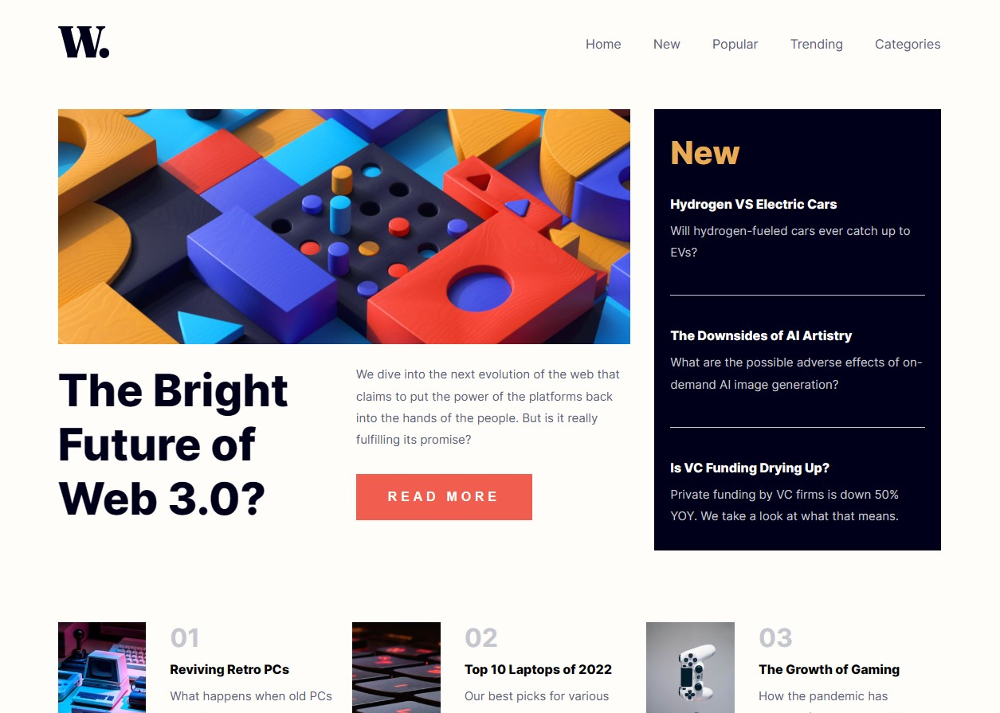

# Frontend Mentor - News homepage solution

This is a solution to the [News homepage challenge on Frontend Mentor](https://www.frontendmentor.io/challenges/news-homepage-H6SWTa1MFl). Frontend Mentor challenges help you improve your coding skills by building realistic projects. 

## Table of contents

- [Overview](#overview)
  - [The challenge](#the-challenge)
  - [Screenshot](#screenshot)
  - [Links](#links)
- [My process](#my-process)
  - [Built with](#built-with)
  - [What I learned](#what-i-learned)
  - [Continued development](#continued-development)
  - [Useful resources](#useful-resources)
- [Author](#author)

## Overview

### The challenge

Users should be able to:

- View the optimal layout for the interface depending on their device's screen size
- See hover and focus states for all interactive elements on the page

### Screenshot

### Links

- Solution URL: [Github](https://github.com/8xMohab/news-homepage)
- Live Site URL: [Netlify](https://chimerical-sopapillas-5843ee.netlify.app/)

## My process

1. I initialized the project with Create Vita and created the files and the project structure.
2. coded the html of the web page by creating two sections: the hero section (divided into main and aside) and the features section.
3. styled it with sass, using partials to manage the files and the BEM naming convention.
4. pushed the project to the git repo and deployed the project with Netlify.

### Built with

- [React](https://reactjs.org/) - JS library
- SASS with BEM (naming convention)
- Mobile-first workflow
- [Vite](https://vitejs.dev/) - JS build tool

### What I learned

In this project, I focused on using SASS, getting used to the BEM naming convention, and practicing productivity and time management techniques.

### Useful resources

- [Coder Coder](https://youtu.be/jfMHA8SqUL4) - This is a great course on SASS with a lot of detail and a lot of information to learn.
- [Kevin Powell](https://youtu.be/SLjHSVwXYq4) - Kevin's channel is really a great resource for CSS content and anyone who wants to learn CSS and styling.

## Author

- Frontend Mentor - [@8xMohab](https://www.frontendmentor.io/profile/8xMohab)
- Twitter - [@8xMohab](https://www.twitter.com/8xMohab)
